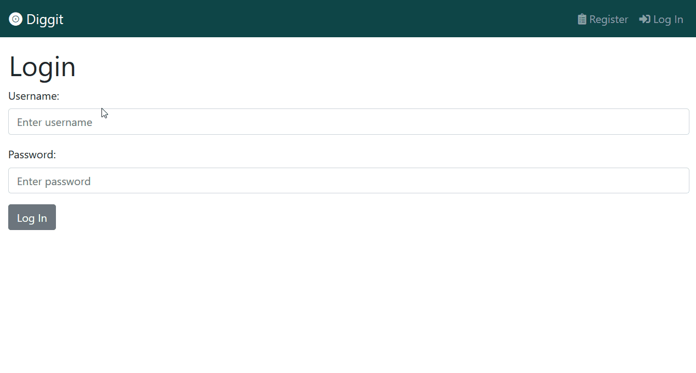

# Diggit
A web application built using Flask along with the discogs API, allowing users to create and share their record collections.

Users can create an account, search for and add records to their 'shelf', view another user's shelf and follow other users.

## Demo


## Installation
Use the package manager [pip](https://pip.pypa.io/en/stable/) to install the required packages. 

```bash
pip install -r requirements.txt
```

## Usage
To run this application on your machine first you will need to sign up for a [Discogs](https://www.discogs.com/developers#page:authentication) account.

Then create a new sub-directory named `instance` in the root directory. In this directory place a blank file named `__init__.py` and a file named `config.py` with the following structure:

```python
# MySQL database credentials
HOST = ''
USER = ''
PASSWD = ''
DB_NAME = ''

# Discogs credentials
API_KEY = ''
API_SECRET = ''

# Flask app secret key (choose this yourself)
SECRET_KEY = ''
```

Next set the following local environment variables. On Windows:

```bash
set FLASK_APP=app
set FLASK_ENV=development
```

Then initialise the database tables:
```bash
flask init-db
```

Finally to run the application locally:
```bash
flask run
```

## License
[MIT](https://choosealicense.com/licenses/mit/)